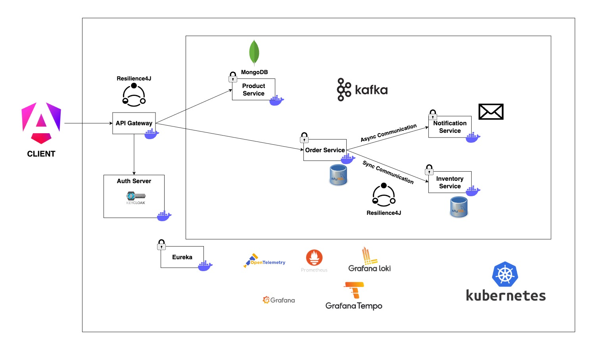

# Spring-Boot-3-Microservices

# Spring Boot 3 Microservices

## Overview

This project is a **Spring Boot 3 microservices-based e-commerce system** designed to demonstrate modern software architecture principles such as scalability, maintainability, fault tolerance, and observability.  

The system is composed of multiple independent services — each responsible for a specific domain — communicating through synchronous REST APIs and asynchronous events.

---

## System Architecture

### 🧩 Core Services

| Service | Responsibility |
|--------|------------------|
| **API Gateway** | Routes requests, handles authentication, and aggregates APIs |
| **Product Service** | Manages product catalog (CRUD operations) |
| **Order Service** | Handles order creation, validation, inventory checks, and event publishing |
| **Inventory Service** | Manages stock levels and availability |
| **Notification Service** | Consumes events and sends notifications (e.g., emails) |
| **Frontend (Angular)** | Provides user-facing web interface |

**Communication model:**
- **Asynchronous messaging:** Using **Apache Kafka + Avro** for inter-service event communication.  
- **Synchronous calls:** Used when immediate response is needed (e.g., order validation).  
- **Resilience patterns:** Circuit Breaker, Retry, Bulkhead, and Time Limiter ensure service reliability.

---

## 📐 Architectural Highlights

### 🪩 Event-Driven Architecture
- Services communicate asynchronously through Kafka events.  
- Example: When an order is created, the `Order Service` publishes an event, which `Inventory Service` and `Notification Service` consume.

### 🛡️ Resilience Patterns
- **Circuit Breaker:** Prevents cascading failures.  
- **Retry:** Handles transient errors.  
- **Bulkhead:** Isolates service failures.  
- **Time Limiter:** Avoids long-running requests.

### 🔎 Observability
Implements the **three pillars** of observability:
- **Metrics:** Collected via Micrometer and scraped by Prometheus.  
- **Logging:** Centralized JSON logs via Loki.  
- **Tracing:** Distributed request tracing with Tempo and Brave/Zipkin.

### 🔐 Security
- Centralized authentication & authorization with Keycloak.  
- API Gateway validates JWT before forwarding requests downstream.

### 🚀 Deployment & CI/CD
- Runs locally with Docker or Kind.  
- Deployable to cloud environments using Kubernetes manifests.  
- Includes metrics dashboards (Grafana), centralized logs, and API documentation (Swagger UI).

---

## 🛠️ Tech Stack

| Layer | Technology | Purpose |
|-------|------------|----------|
| Framework | Spring Boot 3 | Core backend framework |
| API Gateway | Spring Cloud Gateway | Routing & API aggregation |
| Security | Keycloak + OAuth2 / JWT | Authentication & authorization |
| Messaging | Apache Kafka + Avro | Event-driven communication |
| Database | MySQL 8.3 | Relational data storage |
| Frontend | Angular | Single-page application (SPA) |
| Metrics | Prometheus + Micrometer + Actuator | Metrics & monitoring |
| Logging | Loki + Loki4j | Centralized logging |
| Tracing | Tempo + Brave / Zipkin | Distributed tracing |
| Resilience | Resilience4j | Fault tolerance patterns |
| Testing | WireMock + Testcontainers | Integration testing & mocks |
| API Docs | OpenAPI / Swagger | REST API documentation |
| Deployment | Kubernetes / Kind | Container orchestration |
| Build | Maven | Dependency & build management |

---
## 🏗️ System Architecture

1. Grafana:http://localhost:3000
2. Prometheus:http://localhost:9090
3. Tempo:http://localhost:3110
4. Loki:http://localhost:3100
5. Frontend: http://localhost:4200
6. Product Service: http://localhost:8080
7. Order Service: http://localhost:8081
8. Inventory Service: http://localhost:8082
9. Notification Service: http://localhost:8083
10. API Gateway: http://localhost:9000

<!-- 
mvn clean compile package
mvn spring-boot:build-image -DskipTests -Dspring-boot.build-image.publish=true -DdockerPassword=...

kubectl create deployment mysql --image=mysql:8.3.0 --port=3306 --replicas=1 --dry-run=client -o yaml
kubectl create service clusterip mysql --tcp=3306:3306 --dry-run=client -o yaml
kubectl create secret generic mysql-secrets --from-literal=mysql_root_password=mysql --dry-run=client -o yaml
kubectl apply -f mysql.yaml
kubectl get all
kubectl get pods
kubectl logs -f mysql-58db7c4b47-s7rrw
kubectl port-forward svc/mysql 3306:3306       
mysql -h 127.0.0.1 -P 3306 -u root -p

Cmd + Shift + R: find and replace
-->
